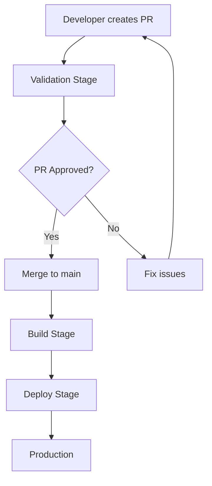

# 🚀 CI/CD Pipeline Documentation

## 📋 GitOps Workflow Overview

This project implements a **GitOps-based CI/CD pipeline** with proper isolation and validation stages.

### 🔄 Workflow Stages



## 🎯 Trigger Strategy

### Pull Request (Validation Only)
- **Packer**: Template validation + syntax check
- **Terraform**: Plan generation + format check
- **Result**: PR comments with validation results

### Merge to Main (Build & Deploy)
- **Packer**: Actual image build + tagging
- **Terraform**: Apply infrastructure changes
- **Result**: Production deployment

## 📁 Path-Based Isolation

| Path Changes | Triggered Workflows |
|---|---|
| `packer/debian/**` | 🐧 Packer Debian only |
| `packer/windows/**` | 🪟 Packer Windows only |
| `terraform/debian/**` | 🚀 Terraform Debian only |
| `terraform/windows/**` | 🚀 Terraform Windows only |
| `ansible/debian/**` | 🐧 Packer Debian (includes Ansible) |
| `ansible/windows/**` | 🪟 Packer Windows (includes Ansible) |

## 🔗 Automated Chaining

When a Packer build completes successfully:
1. **Image is built** and tagged with metadata
2. **Terraform workflow is auto-triggered** with the new image name
3. **VM is deployed** using the fresh golden image

## 🛠️ Workflow Files

### Packer Workflows
- **`packer-debian.yml`**: Debian image validation & build
- **`packer-windows.yml`**: Windows image validation & build

### Terraform Workflows  
- **`terraform-debian.yml`**: Debian infrastructure plan & apply
- **`terraform-windows.yml`**: Windows infrastructure plan & apply

## 🔐 Required Secrets

Add these secrets to your GitHub repository:

```bash
# GitHub Settings > Secrets and variables > Actions
GCP_SA_KEY = "{ ... }"  # Service Account JSON key with permissions:
                        # - Compute Admin
                        # - Service Account User
                        # - Storage Admin (for Terraform state)
```

## 🚀 Usage Examples

### 1. Update Debian Image
```bash
# Make changes to Debian files
git checkout -b feature/update-debian-cis
# Edit packer/debian/ or ansible/debian/ files
git add .
git commit -m "Update Debian CIS hardening"
git push origin feature/update-debian-cis

# Create PR - triggers validation
# Merge PR - triggers build & deploy
```

### 2. Update Windows Infrastructure
```bash
# Make changes to Windows Terraform
git checkout -b feature/update-windows-vm
# Edit terraform/windows/ files
git add .
git commit -m "Update Windows VM configuration"
git push origin feature/update-windows-vm

# Create PR - triggers terraform plan
# Merge PR - triggers terraform apply
```

### 3. Manual Deployment
```bash
# Go to GitHub Actions > Terraform Debian/Windows
# Click "Run workflow"
# Select action: plan/apply/destroy
```

## 📊 Best Practices Implemented

✅ **Validation First**: All changes validated before merge  
✅ **Path Isolation**: Only affected components trigger  
✅ **Automated Chaining**: Packer → Terraform flow  
✅ **Metadata Tagging**: Images tagged with commit SHA  
✅ **PR Comments**: Terraform plans shown in PRs  
✅ **Manual Override**: Workflow dispatch available  
✅ **Proper Secrets**: Secure credential management  

## 🔍 Monitoring & Debugging

### Check Workflow Status
- Go to **Actions** tab in GitHub
- Filter by workflow name or branch
- Check logs for detailed output

### Common Issues
- **Packer fails**: Check GCP permissions and billing
- **Terraform fails**: Verify state backend and permissions  
- **Windows builds**: Ensure billing is enabled for Windows VMs

## 🎯 Next Steps

1. **Set up secrets** in GitHub repository
2. **Test with a small PR** to validate workflows
3. **Monitor first full deployment** end-to-end
4. **Customize** workflows for your specific needs
