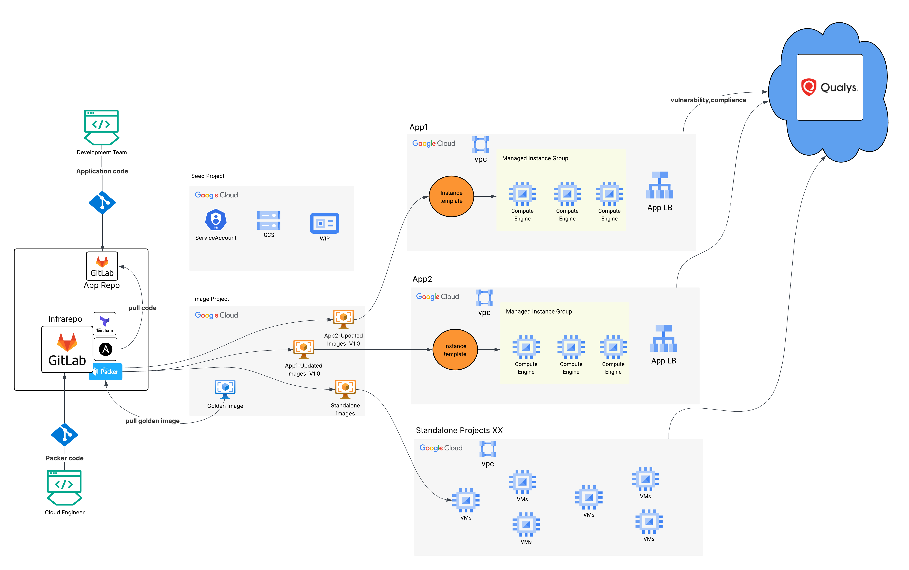

# Multi-OS Golden Image Builder (Packer + Ansible + Terraform)



Build hardened golden images for Debian 11 and Windows Server 2016 with CIS Level 2 security controls, then deploy VMs on GCP.

## 📦 Project Structure

```
📦 Multi-OS Golden Image Builder
├── 🐧 packer/debian/          # Debian 11 + Apache + CIS L2
├── 🪟 packer/windows/         # Windows 2016 + IIS + CIS L2  
├── 🔧 ansible/debian/         # Debian hardening & apps
├── 🔧 ansible/windows/        # Windows hardening & apps
├── 🚀 terraform/debian/       # Debian VM deployment
├── 🚀 terraform/windows/      # Windows VM deployment
├── 📋 build-selector.sh       # Build helper script
└── 📖 README.md              # Documentation
```

## 🛡️ CIS Level 2 Security Features

**🐧 Debian**: Filesystem security, network hardening, SSH security, password policies, audit logging, fail2ban protection  
**🪟 Windows**: Password policies, UAC controls, network security, audit logging, service hardening, firewall configuration

## 🚀 Quick Start

### Prerequisites
```bash
# Install tools
brew install packer ansible terraform google-cloud-sdk

# Authenticate
gcloud auth login --account=admin@cloudedgetechy.com
gcloud config set project root-cortex-465610-p8
gcloud auth application-default login
```

### 🐧 Build Debian Image
```bash
cd packer/debian
packer init simple-apache.pkr.hcl
packer build simple-apache.pkr.hcl
```

### 🪟 Build Windows Image
```bash
cd packer/windows
packer init windows-server-2016.pkr.hcl
packer build windows-server-2016.pkr.hcl
```

### 🚀 Deploy VM
```bash
# Debian
cd terraform/debian && terraform init && terraform apply

# Windows  
cd terraform/windows && terraform init && terraform apply
```

### 🧪 Test
```bash
# Debian
curl http://$(terraform output -raw instance_ip)

# Windows
# Open browser to: http://$(terraform output -raw windows_instance_ip)
```

## 🎯 Build Status

| OS | Status | Requirements |
|---|---|---|
| 🐧 **Debian 11** | ✅ **READY** | Standard GCP project (free tier) |
| 🪟 **Windows 2016** | ⚠️ **Requires Billing** | GCP project with billing enabled |

## 🧹 Cleanup
```bash
terraform destroy -auto-approve
```

---
**Note**: Windows VMs require billing enabled on GCP (not included in free trial). All Windows code is ready and will work immediately once billing is enabled.

## 🎯 **Ready to Test! Here's what we've accomplished:**

### ✅ **Authentication Setup Complete**
- **Service Account**: `github-actions-sa@root-cortex-465610-p8.iam.gserviceaccount.com`
- **Permissions**: Compute Admin + Service Account User
- **Key Generated**: Ready for GitHub Actions

### 🔐 **Next Steps for You:**

1. **Add GitHub Secret**:
   - Go to: https://github.com/anudishu/google-imagebuild-packer/settings/secrets/actions
   - Click "New repository secret"
   - Name: `GCP_SA_KEY`
   - Value: Copy the entire JSON service account key from above
   - Click "Add secret"

2. **Test the Pipeline**:
   ```bash
   git add .
   git commit -m "Setup CI/CD pipeline and test Debian workflow"
   git push origin main
   ```

3. **Monitor Results**:
   - Go to: https://github.com/anudishu/google-imagebuild-packer/actions
   - Watch the "🐧 Packer - Debian Golden Image" workflow

### 🚀 **What Will Happen**:
1. **Push to main** → Triggers Debian Packer workflow
2. **Packer validates** → Builds golden image
3. **Auto-triggers** → Terraform deployment
4. **VM deployed** → Ready to test!

**Ready to add the GitHub secret and push the code?** The authentication is all set up on the GCP side! 🎉
